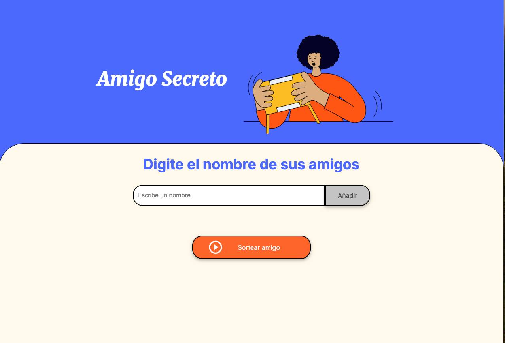

<h1 align="center"> 💻  Proceso de diseño del Desafio Amigo Secreto 🤖 </h1>

***

Acciones ejecutadas 📋

<li>Descarga de repo con los elementos base</li>
<li>Creación de repositorio Github</li>
<li>descarga de respositorio usando git clone para trabajar en local</li>
<li>Prueba de conexión</li>
<li>Creación de arreglo amigos</li>
<li>Capturar el valor del nombre del amigo</li>
<li>Validar el campo</li>
<li>Agregar y actualizar el array de amigos</li>
<li>Sortear amigos</li>

***

`Tecnologías y herramientas utilizadas`
-HTML
-CSS
-Javascript
-VSCode

👨🏻‍💻 Creado por Marcelo Oñate

